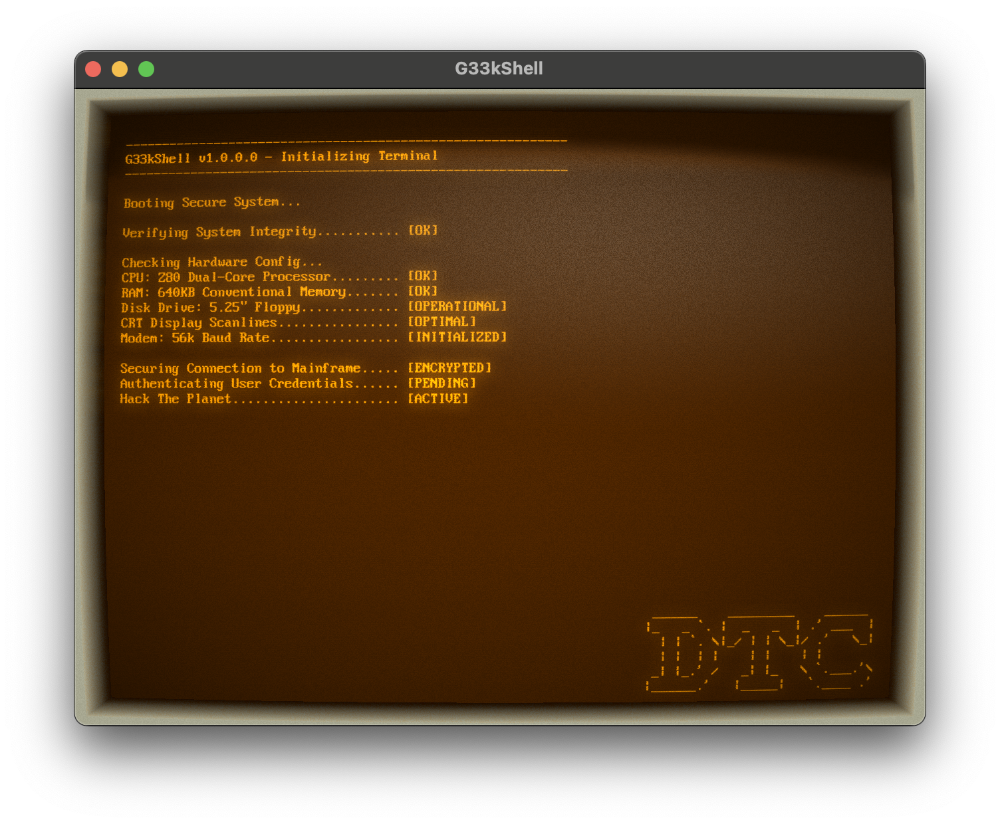
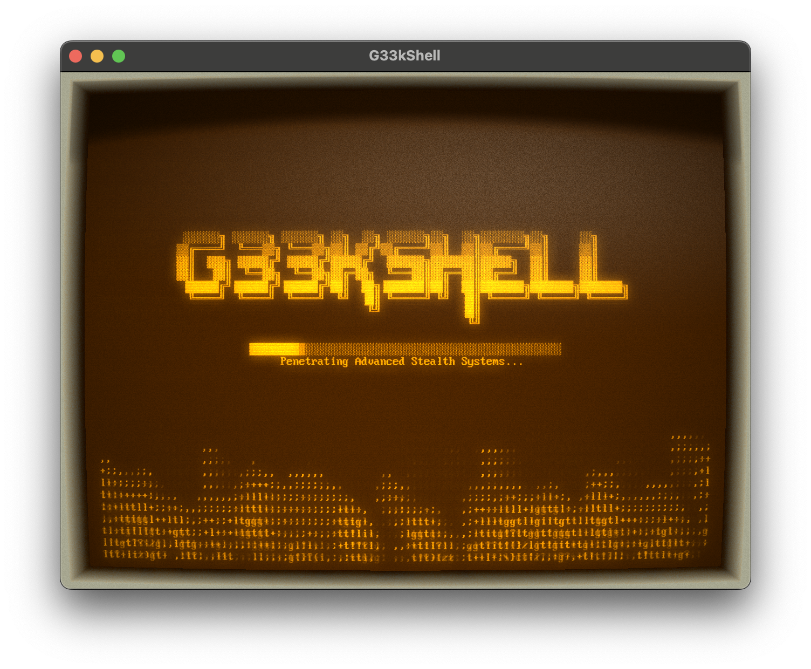
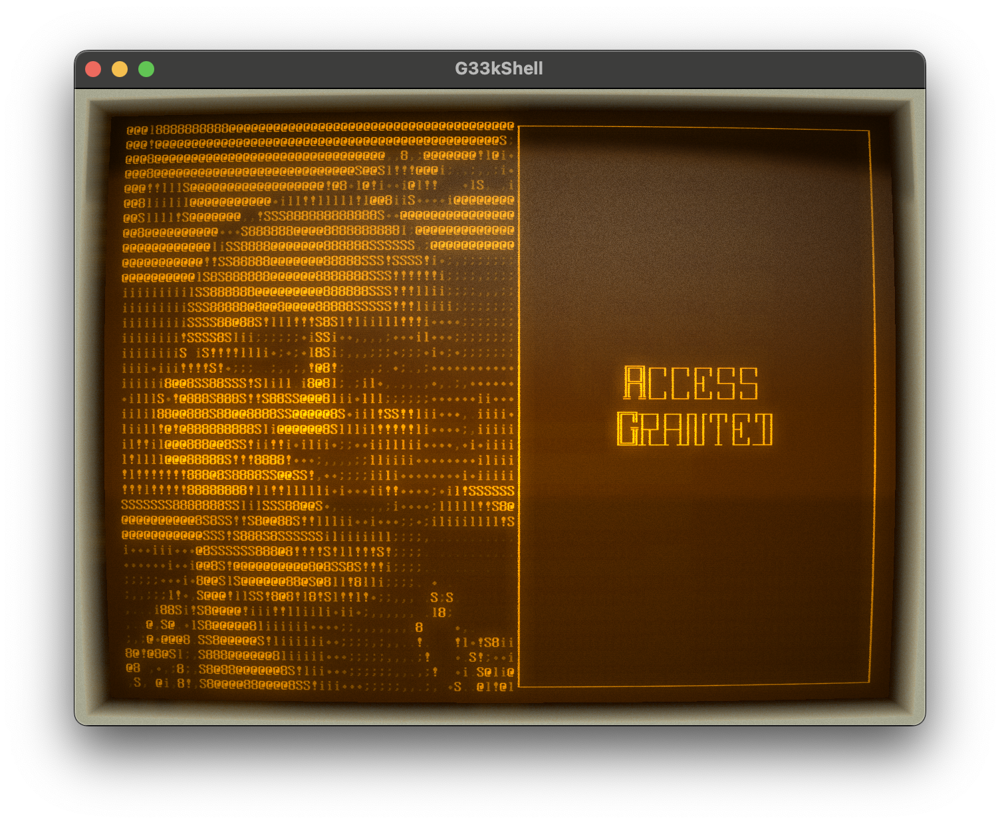

# G33kShell
**G33kShell** is a cross-platform retro-themed desktop shell that wraps a CRT aesthetic around a custom command experience.

## Highlights
- Boot-up BIOS prelude, login theatrics, and optional webcam face detection.
- Powered by Avalonia on .NET for cross-platform hardware-accelerated rendering with crisp pixel fonts and shader-based scanlines.
- Extensive built-in command set spanning navigation, search, system info, automation, and novelty utilities.
- Inline `man` pages, persistent history, and settings that remember your favorite skins, screensavers, and working directories.
- Skin system with `RetroPlasma`, `RetroGreenDos`, `RetroMonoDos`, and `SimpleSkin`.
- Idle timeout hands ownership to animated ASCII and pixel-art screensavers — many driven by AI brains you can train live.

## Built-in Commands
- Navigate your filesystem with `dir`, `tree`, `cd`, `pushd`, `popd`, `paths`, and `location`.
- Inspect and manipulate files via `cat`, `tail`, `copy`, `rm`, `mkdir`, `find`, `grep`, `whereis`, and `open`.
- Integrate with the OS using `reveal`, `space`, `clip`, `now`, `ver`, `worktime`, `shutdown`, and `max`.
- Customize the experience with `skin`, `screensaver`, `man`, `help`, `history`, and the CP437 `ASCII` table.

Tip: run `man <command>` for auto-generated manual pages, or `help` to see every command and alias.

## Screensavers
Cycle anything you like with `screensaver -l` and `screensaver <name>`—add `_train` to the AI-powered ones to watch them learn in real time.

- `asciiroids`, `boids`, `bounce`, `clock`, `conway`, `crystal`, `cube`, `defrag`
- `donut`, `earth`, `fire`, `fluid`, `lemmings`, `mandelbrot`, `matrix`, `neo`
- `plasma`, `pong`, `scroller`, `snake`, `stars`, `swirl`, `tbibm`, `terminator`
- `tiefighter`, `tunnel`, `twister`, `willy`, `worms`, `xenon`

AI-enabled screensavers (`asciiroids`, `pong`, `snake`) store their trained neural weights between runs so you can pick up right where your last session left off.

## Quick Start
- Install the [.NET 8 SDK](https://dotnet.microsoft.com/download).
- Clone the repo and restore dependencies: `dotnet restore`.
- Launch the desktop shell: `dotnet run --project G33kShell.Desktop`.

The application persists settings (skin, screensaver, path history, trained brains) under your user profile. Delete the settings file if you ever want a clean slate.

## Development Notes
- Run the unit suite with `dotnet test` from the repo root.
- Avalonia assets live under `G33kShell.Desktop/Assets`; screensavers under `G33kShell.Desktop/Console/Screensavers`.
- To build your own screensaver, implement `IScreensaver`, expose a unique `Name`, and drop the class into the screensavers folder — `screensaver -l` will pick it up automatically.

## License
MIT © Dean Edis. See `LICENSE` for details.