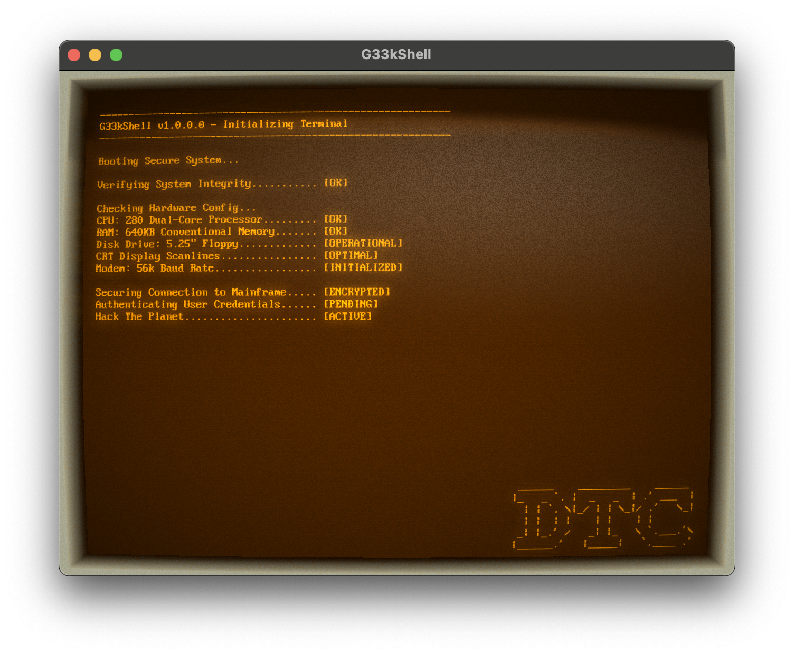
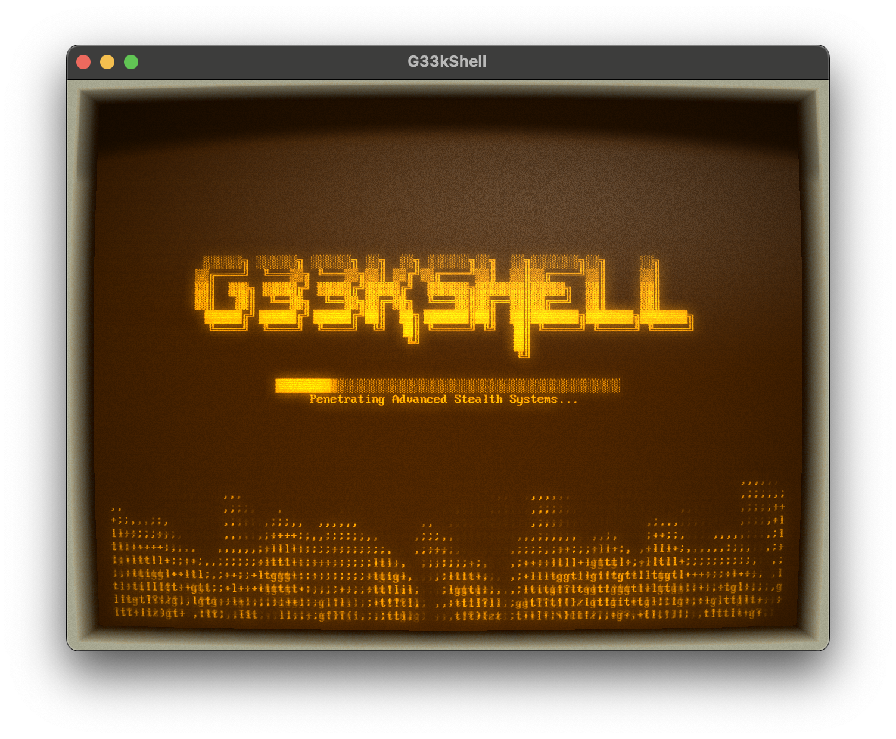
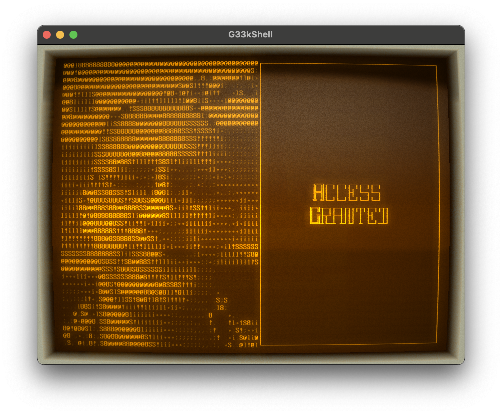

# G33kShell
**G33kShell** is a cross-platform retro-themed desktop shell that wraps a CRT aesthetic around a custom command experience.

## Highlights
- Boot-up BIOS prelude, login theatrics, and optional webcam face detection.
- Powered by Avalonia on .NET for cross-platform hardware-accelerated rendering with crisp pixel fonts and shader-based scanlines.
- Extensive built-in command set spanning navigation, search, system info, automation, and novelty utilities.
- Inline `man` pages, persistent history, and settings that remember your favorite skins, screensavers, and working directories.
- Skin system with `RetroPlasma`, `RetroGreenDos`, `RetroMonoDos`, and `SimpleSkin`.
- Idle timeout hands ownership to animated ASCII and pixel-art screensavers — many driven by AI brains you can train live.

## Built-in Commands
- Navigate your filesystem with `dir`, `tree`, `cd`, `pushd`, `popd`, `paths`, and `location`.
- Inspect and manipulate files via `cat`, `tail`, `copy`, `rm`, `mkdir`, `find`, `grep`, `whereis`, and `open`.
- Integrate with the OS using `reveal`, `space`, `clip`, `now`, `ver`, `worktime`, `shutdown`, and `max`.
- Customize the experience with `skin`, `screensaver`, `man`, `help`, `history`, and the CP437 `ASCII` table.

Tip: run `man <command>` for auto-generated manual pages, or `help` to see every command and alias.

## Useful Command Tips
- Reuse lines from the previous command's output with `$<n>` (for example, `cat $4`).
- Copy the last command output to the clipboard with `clip` (use `clip -n` to show line numbers or `clip 4` for a single line).

## Screensavers
Cycle anything you like with `screensaver -l` and `screensaver <name>` - add `_train` to the AI-powered ones to watch them learn in real time.

| Screensaver | Description |
| --- | --- |
| `asciiroids` | AI Asteroids in ASCII; add `_train` to teach it. |
| `badapple` | Mono pixel-art silhouette animation in the Bad Apple style. |
| `boids` | Flocking boids orbit a wandering sphere. |
| `bounce` | Breakout-style brick field with ricocheting faces. |
| `clock` | Big retro clock for the night shift. |
| `conway` | Conway's Game of Life, always plotting. |
| `crystal` | Growing crystal shard in chunky pixels. |
| `cube` | Spinning 3D wireframe cube. |
| `defrag` | Disk defrag blocks click into place. |
| `donut` | The classic spinning ASCII torus. |
| `earth` | Rotating ASCII Earth, tiny and proud. |
| `fire` | Flickering fire buffer, CRT cozy. |
| `fluid` | Low-res fluid sim, surprisingly hypnotic. |
| `heist` | Your last screen gets stolen, then returned. |
| `lemmings` | Tiny lemmings on an endless march. |
| `mandelbrot` | Mandelbrot zooms in chunky characters. |
| `matrix` | Matrix-style code rain. |
| `neo` | Matrix corridor with glowing trails. |
| `pipes` | Chunky monochrome 3D pipes grow through a shaded pixel grid. |
| `plasma` | Old-school plasma waves. |
| `pong` | AI pong duel; add `_train` to coach it. |
| `sand` | Sand pours over your last screen and settles. |
| `science` | A roaming glass lens refracts a snapshot of your terminal. |
| `scroller` | Retro text scroller for demo vibes. |
| `snake` | AI snake that learns; add `_train`. |
| `stars` | Warp-speed starfield. |
| `swirl` | Hypnotic swirl patterns. |
| `tbibm` | The British IBM tribute with Friday-night swagger. |
| `terminator` | Pixelated Terminator portrait. |
| `tiefighter` | 3D Tie Fighter flyby. |
| `tron` | Light-cycle trails with a tracking camera. |
| `tunnel` | Endless ASCII tunnel run. |
| `twister` | Column twist effect. |
| `willy` | Miner Willy marches across the screen. |
| `worms` | Glowing worms wriggle across the grid. |
| `xenon` | Xenon 2 shopkeeper cameo. |

AI-enabled screensavers (`asciiroids`, `pong`, `snake`) store their trained neural weights between runs so you can pick up right where your last session left off.

### Bad Apple compression notes

The `badapple` screensaver uses a tiny custom 1bpp movie format rather than shipping thousands of source frames. The source animation started as 6,572 480x360 JPEG frames at 30 fps. We reduce those to 128x120 mono frames, sample the movie down to 5,258 frames at 24 fps, then store the pixels rotated by 270 degrees because those scanlines produce far fewer RLE runs. Playback rotates the pixels back while decoding into the pixel screen.

The frame stream is encoded as one continuous alternating run-length stream across frame boundaries. A single initial colour is stored, then each run byte either draws that many pixels and toggles colour (`1..255`), or extends the current colour by 255 pixels without toggling (`0`). The resulting blob is wrapped with the existing `ByteExtensions.Compress()` LZ4 helper.

Final asset numbers:

| Stage | Size |
| --- | ---: |
| Raw 128x120 1bpp frames at 24 fps | ~9.6 MiB |
| Rotated continuous RLE stream | 1,358,933 bytes |
| LZ4-packed `.bar` asset | 987,617 bytes |

Several tempting alternatives were tested and lost to this simpler format: row dictionaries, duplicate-frame references, cropped frame bounds, XOR deltas, bit-packed run tokens, previous-row reuse, and 16-bit run lengths. Rotation and 24 fps sampling were the only tricks that delivered worthwhile savings without complicating playback.

## Quick Start
- Install the [.NET 8 SDK](https://dotnet.microsoft.com/download).
- Clone the repo and restore dependencies: `dotnet restore`.
- Launch the desktop shell: `dotnet run --project G33kShell.Desktop`.

The application persists settings (skin, screensaver, path history, trained brains) under your user profile. Delete the settings file if you ever want a clean slate.

## Development Notes
- Run the unit suite with `dotnet test` from the repo root.
- Avalonia assets live under `G33kShell.Desktop/Assets`; screensavers under `G33kShell.Desktop/Console/Screensavers`.
- To build your own screensaver, implement `IScreensaver`, expose a unique `Name`, and drop the class into the screensavers folder — `screensaver -l` will pick it up automatically.

## License
MIT © Dean Edis. See `LICENSE` for details.
